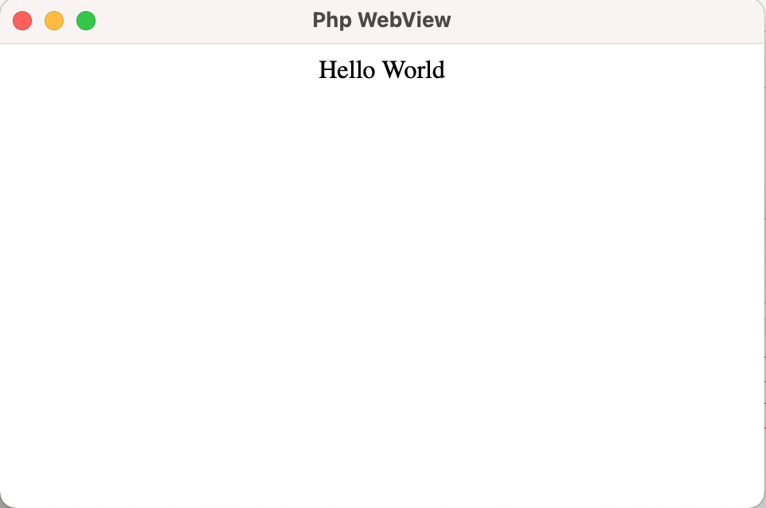
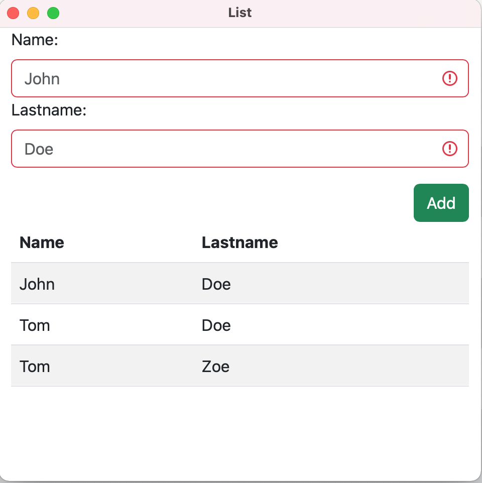

# PHP WebView

**Php WebView Application Library**

PHP bindings for [zserge's Webview](https://github.com/webview/webview)

### Hello World Application




```php
<?php

require_once '../../vendor/autoload.php';

use PhpWebView\Example\RowContext;
use PhpWebView\WebView;
use PhpWebView\WindowSizeHint;

$webview = new WebView('Php WebView', 480, 320, WindowSizeHint::HINT_NONE, true);

$webview->setHTML('<center> Hello World </center>');

$webview->run();
$webview->destroy();

```

### Binding

```php
$webview->bind('save', function ($seq, $req, $context) use (&$list) {
    $name = $req[0];
    $lastname = $req[1];
    if (empty($name) || empty($lastname)) {
        return ['name' => empty($name), 'lastname' => empty($lastname)];
    } else {
        $list[] = ['name' => $name, 'lastname' => $lastname];
    }

    return [];
});

$webview->bind('getList', function ($seq, $req, $context) use ($webview, &$list) {
    $webview->returnValue($seq, 0, $list);
});
```

